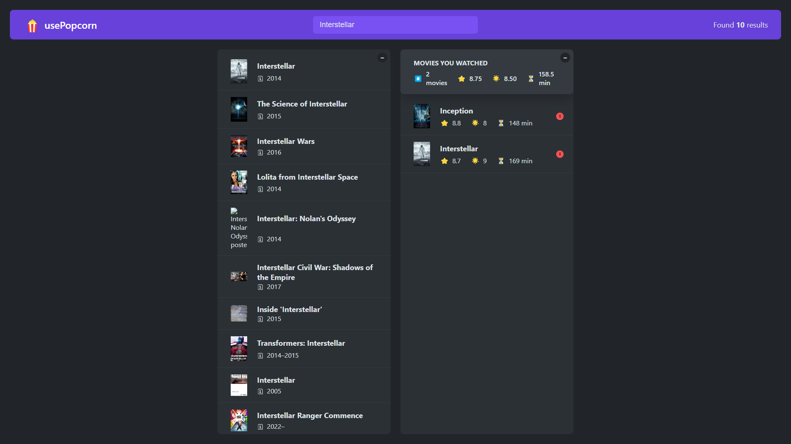

  

---

# usePopcorn

## Description



This is a practice React application that allows users to search for movies from a Movie API (www.omdbapi.com). The main goal of this project was to get a grasp of the useState() hook and the flow of data (props). The application also allows users to rate the movies they watched and save their favorite movies to local storage. This application is not deployed on the web. Please see the installation section below to run the application on your local machine.

```bash
npm run start
```

---

## Table of Contents

- [Installation](#installation)
- [Usage](#usage)
- [Credits](#credits)
- [License](#license)
- [Contributing](#contributing)
- [Tests](#tests)
- [Questions](#questions)

---

## Installation

You will have to run this program in your terminal.

To install necessary dependencies (inquirer module, etc), run the following command:

```bash
npm i
```

---

## Usage

This application runs on web browsers. To run the application, run the following command:

```bash
npm start
```

A web browser should open up with the application. If not, open a web browser and go to http://localhost:3000.

ATTENTION: This app requires an API key from www.omdbapi.com. Please go to the website and request an API key. Once you have the API key, create a .env file in the root directory and add the following line in .env file:

```bash
REACT_APP_KEY='YOUR_API_KEY'
```

Once you have completed the above steps, you should be able to use the application without any issues.

---

## Credits

Thank you, Jonas Schmedtmann, for providing amazing CSS styles, React guides and instructions!

---

## Contributing

For contributions, please create a new branch of the project and submit a pull request. Any contributions are greatly appreciated. Issues can be submitted in the issues section of the repo or by emailing me directly (see Questions section below).

---

## Tests

Test feature is not available at this time.

---

## Questions

If you have any questions about the repo, open an issue or contact me directly at:

Github: [jyoungjoon](https://github.com/jyoungjoon)

Email: lifescriptified@gmail.com

---
